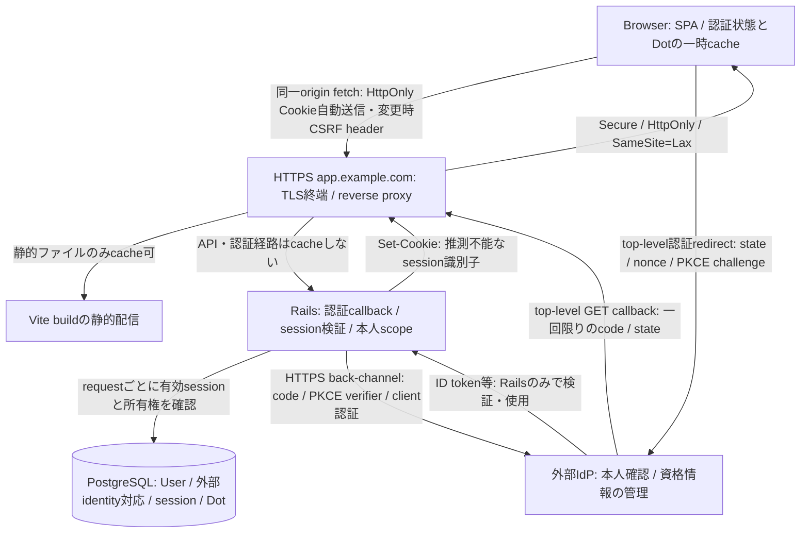

# TASK-001 認証と利用者識別の設計比較 Implementation Plan

## 1. Status

実施中（2026-09-22更新）。外部IdPの本人確認 + Railsのserver-side session + RailsのDot認可を第一候補として進める方向はユーザーと共有済み。配信先・IdP・ログイン手段・期限等は未確定で、認証コードは実装していない。§16–24は2026-09-21時点、§25–32は国内保管要件の追加整理前の比較記録。最新の所在地要件・条件別推奨は§33–39を参照。国内保管の必須化自体も未承認であり、詳細案は現行仕様として未確定。

## 2. Goal

配信構成、本人限定アクセス、認証の開始・終了・失効、運用負荷を比較し、最初の永続Dot APIの認証方針を判断できる資料を用意する。未承認の案を決定済み仕様にしない。

## 3. Background

TASK-001に上流の依存タスクはない。product §5とjournaling §4–5は認証方式を未決定とし、保存されたDotへの本人限定アクセスを要求する。既存のbrowser stateでは本人性や複数端末での所有権を保証できない。

## 4. Current State

- 開始ブランチは`main`。HEAD、`origin/main`、`git ls-remote origin refs/heads/main`は`4b5365b17437df07f52620edd0ecb98cbe0eaf47`で一致。PR #26までマージ済み。
- 追跡済みファイルの差分はなく、未追跡`.worktrees/`がある。そこには触れない。コミット・push・PRは行わない。
- Railsは8.1.3.1のAPI-only構成。`ApplicationController < ActionController::API`で公開routeは`GET /up`のみ。User、認証、Dotモデル、認証用Gem、Cookie/session/CSRF/CORSの設定は未追加。
- production設定はSSL終端reverse proxyを想定するが、実際の配信先・ドメイン・proxyは確定していない。Vite設定にもAPI proxyはない。
- WebのSession Providerは`fod.session.v1`へ録音時間と現在のDotを保存し、利用者を区別しない。認証sessionではない。
- `createDot`は本文なしPOSTで、資格情報やCSRF対策を指定していない。routerにも認証guardはない。実サービス契約として流用しない。
- Rails基盤Planは認証・CORSを明示的に対象外にしている。同Planには実行結果の完了記録がなく、今回runtime成功を推定しない。タスク整理Planの検証は文書の整合確認であり、認証の実証ではない。

## 5. Scope and Non-goals

対象は認証方式、利用者識別、配信構成、脅威と対策、運用責務、開始・終了・失効と本人限定アクセスの設計比較。コード、依存、環境、配信設定は変更しない。

TASK-002の保持期間・削除手段、TASK-003の生成・Job方式、TASK-004の履歴、TASK-005の正式endpoint/schemaは確定しない。これらへ渡す認証境界だけを整理する。providerの契約・登録・課金も行わない。

## 6. References and Documents to Update

- 規約: `AGENTS.md`、`/Users/fujiemasaki/.codex/personal-conventions.md`、同directoryの`rails-conventions.md`、frontend/backend実装規約・レビュー入口・security指針。
- 仕様: [product §5](../product.md#5-保留事項と再検討条件)、[journaling §4–5](../journaling.md#4-実サービスのmvp受け入れ条件)、[architecture](../architecture.md)、[Dot履歴 §2](../dot-history.md#2-mvpで必要な履歴体験)。
- 関連Plan: [Rails基盤](2026-09-18-rails-api-foundation.md)、[タスク整理とID統一](2026-09-20-mvp-task-inventory.md)。
- 対象コード: `apps/api/config/{application,routes}.rb`、`apps/api/config/environments/production.rb`、`apps/api/app/controllers/application_controller.rb`、`apps/api/config/initializers/filter_parameter_logging.rb`、`apps/api/Gemfile`、`apps/api/spec/requests/health_spec.rb`、`apps/web/vite.config.ts`、`apps/web/src/{router,providers}.tsx`、`apps/web/src/features/session/session-context.tsx`、`apps/web/src/features/processing/create-dot.ts`。
- 更新: TASK-001、本Plan。比較資料は本Planに集約し、TASK-005へ未承認の引継ぎ項目をリンクする。仕様に決定を反映するのは承認後。承認待ちの段階でproduct/journaling/architectureの現行仕様は変更しない。

## 7. Proposed Approach

1. 開始状態、依存、仕様と対象コードを照合する。
2. 一次資料でCookie、CSRF/CORS、OIDC、失効の制約を確認する。
3. 認証手段とアプリsessionを区別し、配信別の成立条件・利用者識別・運用負荷を比較する。
4. 推奨構成の図、状態遷移、2人・未認証・失効の操作表、脅威対策と契約への引継ぎを作る。
5. 差分・リンク・完了条件を検証し、人間へ選択を求める。未承認ならIn progressを維持する。

## 8. Why This Approach

IdPの本人確認とアプリのsession保持は併用できる。別々の選択軸として整理すると、現在のSPAとRailsを保ちながら、browserに持たせる資格情報とサーバーの所有権判断を説明できる。配信・providerが未確定であることも判断条件として明示する。

## 9. Data Flow

現行データフローは変更しない。以下は**未承認の推奨案**。`app.example.com`は説明用で、実ドメインではない。



- User Action → Component → 認証Hook/状態確認 → Railsのsession確認 → 最小の利用者情報 → Webの認証state → UI。Webのstateは表示用で、認証の正本はRailsが検証するDB session。
- Dot操作は認証済みUser → そのUserのDot scope → DB → response → 利用者別Query cache → UI。外部identityはIdPで検証し、内部User UUIDとの対応とDot所有権はアプリDBを正本にする。
- CookieはbrowserのCookie領域だけに置き、JSへsession識別子を返さない。CSRF tokenは同一originの保護した応答から取得しmemoryで保持する。localStorage / sessionStorage / IndexedDBへ認証資格情報を保存しない。
- OIDC取引のstate・nonce・PKCE verifierはRails側に短期保存し、一回限りの取引をbrowserのHttpOnly Cookieに結び付ける。codeはcallback URLを一時通過するため、Rails/proxy/監視のquery記録を抑止し、処理後は秘密を含まないURLへredirectする。
- client secretはサーバー側のsecret管理へ置く。IdP tokenをWebへ渡さず、ログイン検証後は保持しない案。外部API操作は不要なのでrefresh tokenやoffline accessを要求しない。IdPにはDot・音声・文字起こしを送らない。

## 10. Files to Change

- 新規: 本Plan（比較・理由・図・検証証跡）。
- 変更: [TASK-001](../tasks/TASK-001-identity-design.md)（In progress、Plan参照、完了条件別の進捗）。
- 変更: [TASK-005](../tasks/TASK-005-product-api-contract.md)（認証契約への引継ぎ資料参照。状態や契約自体は変更しない）。

## 11. Libraries / APIs

新規dependencyなし。OIDCとWeb標準を資料として調べる。Gem・SDKの具体的な採用とRails API-onlyへの組込みはTASK-006のPlanで検証する。

## 12. Alternatives Considered

§17–19に認証・session・配信の各案を記載する。

## 13. Risks / Things to Watch

未承認案の仕様化、同一siteと同一originの混同、IdP失効とアプリsession失効の混同、利用者切替時の旧データ表示、他人のDot IDによるアクセス、logout失敗・遅延response・再試行を確認する。現行mockの未認証動作を実サービスの安全性と混同しない。

## 14. Verification

### Manual

2人・未認証・失効の保存/一覧/詳細/更新/削除を机上確認する。図の資格情報の保存・送信経路と脅威対策を照合する。採用未決定・未実装・未検証の境界を確認する。

### Automated

Markdown相対リンク、TASK IDとファイルの維持、差分範囲、空白エラーを確認する。文書のみのためアプリtest/buildや実認証試験は行わず、その理由を記録する。

## 15. Definition of Done

TASK-001の4完了条件と必要な検証が揃うこと。比較資料作成だけではDoneにしない。人間の採用判断、現行仕様への反映、契約への確定引継ぎが未了なら残す。

## 16. Completion Record

- 状態: In progress（2026-09-21）。人間による方式・成立条件・期限/失効範囲の判断待ち。
- 実施内容: 本人確認6案、アプリ資格情報3案、配信3構成を比較。推奨構成、Userの正本、資格情報経路、脅威対策、2人/未認証/失効の操作表、後続への論点を作成した。
- 計画との差異: なし。認証コード・dependency・設定・現行仕様は変更していない。変更は本PlanとTASK-001/005のみ。TASK-005への追加は未確定資料の参照で、契約作成や状態変更ではない。
- 開始確認: `git status --short --branch`、`git branch -vv`、`git log -6 --oneline`、`git ls-remote origin refs/heads/main`でmainと最新マージ済み状態を照合。最初のls-remoteはsandbox内のDNS解決で失敗し、読み取り専用の再実行で一致を確認した。
- 机上検証: §9のCookie/OIDC code/server token/DBの経路を§20–21と照合。§22のA/B/未認証/失効と5操作を追跡し、所有権・資格情報・失効の境界を説明できることを確認した。成功後の応答喪失・logout失敗・受理済み処理・遅延responseも区別した。
- 独立レビュー: AGENTS.mdに従い別AIへ設計レビューを依頼。両領域のsecurity指針・関連仕様と照合し、LGTM（Critical / High / Mediumの修正必須指摘なし）。認証/session/配信の分離、所有者境界、失効・応答喪失・利用者切替、未承認と後続タスクの境界を確認した。これは設計資料への評価であり、実装の安全性やprovider適合性の証明ではない。
- 機械検証: Pythonで変更3文書の相対リンク/見出しリンク18件、Planの24節、タスク16件のID/パス/依存節の維持、TASK-001以外の状態不変を確認。追跡済みdiffがTASK-001/005だけであることとindex不変を確認した。
- 空白検証: `git diff --check`、新規Planへの`git diff --no-index --check -- /dev/null docs/implementation-plans/2026-09-21-task-001-identity-design.md`を通過。
- 差分確認: 認証設計の範囲、他人のデータ参照、失敗・中断・再試行、未承認の境界、架空のdomain/主体だけを使っていることを確認。秘密情報や実利用者データを記載せず、`.worktrees/`に触れていない。コミット・push・PRは未実施。
- 未実施: アプリtest/build、実providerのcallback/失効試験、配信・browserのCookie/CSRF/CORS試験。文書のみで、採用provider/domainも未決定のため。実動作の証跡はTASK-006/007/015等で取得する。
- 次の作業: 採用判断後にproduct/journaling/architectureへ確定内容を反映し、TASK-005へ確定条件を渡す。新たにBlocked解除できる後続はない。依存なしのTASK-002/003/004は従前どおり比較検討に着手可能であり、今回実施していない。

### TASK-001完了条件ごとの結果

| 条件 | 結果 | 根拠 / 残作業 |
| --- | --- | --- |
| 認証方式・正本・開始/終了/失効を決定し、人間が理由を確認 | 未完了 | §17–20に推奨案。§24の人間判断と配信/providerの成立条件が未確定 |
| 選択肢を配信・脅威・運用負荷で比較 | 完了 | §17–21の比較表・理由・脅威表。一次資料を参照し、構成の推奨は設計上の評価として区別 |
| 採用方式の資格情報、CSRF/CORS、認可境界を明文化 | 未完了（案の明文化済み） | §9/20–22に具体案と机上検証。方式未承認のため「採用方式」としては未完了 |
| product/journaling/architectureへ決定反映しTASK-005へ渡す | 未完了（論点の引継ぎ済み） | TASK-005から§23への参照を追加。正本仕様の更新と確定契約への引継ぎは承認後 |

TASK-001をDoneにしていない。必要な検証2項目（主体の説明、経路図と脅威レビュー）は提案に対する机上確認として実施し、採用承認や稼働試験の代替にはしていない。

## 17. 認証手段と利用者識別の比較（未承認）

「CookieかIdPか」は二者択一ではない。本人確認の手段、ログイン後の資格情報、配信構成を別々に選ぶ。以下の負荷は現行のSPA/Rails/PostgreSQLを前提とする設計評価で、providerの見積りや実測ではない。

| 本人確認の選択肢 | 利点 | 欠点・主な脅威 | 運用負荷・適用条件 | 評価 |
| --- | --- | --- | --- | --- |
| 管理型IdPのhosted login + OIDC | パスワード・MFA・復旧処理をサービスに任せられる。Railsは検証と対応付けに集中できる | IdP障害・アカウント乗っ取りの影響、利用条件・費用・移行制約。アプリの認可は自前で必要 | 中。登録、redirect管理、鍵更新、費用監視、復旧案内、障害対応が残る | 推奨候補。料金・利用対象・復旧手段を確認して1 providerに絞る |
| 特定のsocial IdPへ直接OIDC接続 | 利用者が既存アカウントを使える。仲介サービスを減らせる | そのアカウントを持てない利用者を除外。provider固有の審査・停止・復旧に依存 | 中。対象者がそのIdPを使えるなら有力 | 対象者が未確定なので一律採用しない |
| Railsでメールmagic link / OTP | アプリ用パスワード不要。social accountを要求しない | mailbox乗っ取り、リンク転送・漏えい、再利用、OTP総当たり、メールscannerによる誤消費 | 中〜高。配送・遅延・spam対策、期限・一回使用・rate limit・復旧窓口が必要 | 外部IdPを避けたい場合の有力代替。運用者がメールと不正利用対応を引き受ける |
| Railsでメール + パスワード | UXとアカウント方針を自分で管理できる | password再利用、総当たり、漏えい、復旧経路の悪用 | 高。安全なhash、リセット・検証メール、MFA、監視・インシデント対応 | 小規模MVPでは責務が重い。自主管理要件がある場合に再検討 |
| Passkeyを直接管理 | フィッシング耐性を期待でき、日々の入力が少ない | 端末紛失、複数端末・復旧設計、対応環境で利用差がある | 中〜高。WebAuthn検証、credential lifecycleと復旧が必要 | 初回から自前で導入せず、IdP側対応を選定条件にできる |
| 匿名の端末ID / localStorage UUID | 登録操作がない | 改ざん・端末共有・消去・紛失で本人性や復旧を保証できない | 当初は低いが、本人への帰属・移行対応が難しい | server保存の本人限定条件に不適。認証方式として採用しない |

Passkey案の技術的な前提は、origin/RPに結び付いた公開鍵credentialを扱う[W3C WebAuthn](https://www.w3.org/TR/webauthn-3/)を参照。ここでの比較は認証手段の分類であり、利用者端末での成立性を検証したものではない。本文の外部資料は2026-09-21に確認した。

### 内部の利用者識別

推奨はアプリDBの不変な`User UUID`。外部IdPを使う場合は検証済みの`(issuer, subject)`をそのUserへ一意に対応付ける。Dot等はUser UUIDに紐付け、メールアドレス・表示名・browserのIDを所有権に使わない。OIDCはissuer内でsubjectを識別子として扱う。根拠: [OIDC Core §8](https://openid.net/specs/openid-connect-core-1_0.html#SubjectIDTypes)。

- `sub`単独では異なるissuerの利用者を区別できない。emailは変わり得るため、同じemailというだけで既存Userに結合しない。
- 初回ログインは検証完了後に対応とUserを一体で作成し、一意制約で同時callbackによる重複Userを防ぐ。失敗時は認証済みにしない。
- issuerはサーバー設定の許可先に固定し、request任意のissuer / discovery URLを使わない。IdP移行や複数identityの紐付けは別の本人確認を伴う変更とし、MVPに自動統合機能を加えない。
- 削除後の再登録、外部identity対応の保持、停止されたUserの扱いはTASK-002と整合させる。旧Dotをemail一致で復元・再帰属させない。

## 18. アプリ資格情報の比較（未承認）

Cookieは送信手段、sessionはログイン状態、JWTはtoken形式であり、混同しない。Cookie内のtokenもbrowserが自動送信すればCSRF対策が必要になる。

| 案 | 利点 | 欠点・脅威 | 運用負荷 | 評価 |
| --- | --- | --- | --- | --- |
| 推測不能な識別子のHttpOnly Cookie + DB session | JSから資格情報を読み出せず、serverで期限・logout・強制失効を一元管理できる | Cookie送信にはCSRF対策が必要。XSSによる本人操作までは防げない。DB停止時は利用停止 | requestごとのDB確認、期限切れ掃除、失効運用。既存PostgreSQLを使える | 推奨。session用の別サービスを増やさず、失効を説明しやすい |
| Rails CookieStoreのみ | server session tableが不要で構成が小さい | コピー済みCookieの個別失効はbrowserでのCookie消去だけでは保証できない | logout/停止を保証するにはversion照合や失効表等が必要になる | CookieStore自体が危険という意味ではないが、今回の失効要件にはDB照合が明快 |
| SPAがBearer access tokenを保持してAPIへ送信 | 自動Cookie送信に依存せず、別サイトAPIや将来のnative clientと相性がよい | XSSで読み出し/悪用され得る。更新token、再読込、失効、audience・鍵管理が複雑 | 中〜高。短命token + refresh rotation/再認証、必要に応じ失効確認 | 別サイトを固定する必要がある場合の代替。現在のWebだけなら利点が小さい |

署名JWTの期限内失効には別の確認・失効機構が必要。opaque Bearer tokenならserver照合を選べるが、JS保管の問題は残る。tokenをlocalStorageへ置く案はfrontend規約に反する。Cookie replayとserver側状態の検討根拠: [Rails Security Guide §3.5](https://guides.rubyonrails.org/security.html#replay-attacks-for-cookiestore-sessions)。

## 19. 配信構成の比較（未承認）

originはscheme/host/portの組み合わせ。same-siteでもcross-originにはなり得る。repositoryが同じことや、Web/APIを別々にdeployすることだけではbrowserからのoriginは決まらない。

| 配信構成 | 資格情報・CSRF/CORS | 利点 | 欠点・運用負荷 / 評価 |
| --- | --- | --- | --- |
| `https://app.example.com`でSPAと`/api/v1`・認証経路をpath分岐 | host-only Cookie、same-origin fetch。Web→APIのCORS許可は不要。変更操作にはCSRF token + Origin検証 | browserの境界が単純。Web/APIは内部で別deployを維持できる | reverse proxyの経路、TLS、Cookie転送、cache除外、SPA fallbackの誤適用を管理する。推奨 |
| `https://app.example.com`と`https://api.example.com` | 同一siteだが別origin。API host-only Cookie + `credentials: include`、厳密なorigin allowlist、credentials許可、CSRF | 配信先を分けやすく、first-party構成を維持できる | preflight、環境別allowlist、兄弟subdomainへの警戒が増える。次点。Cookieを親domainへ広げる必要はない |
| `https://app.example.com`と`https://api.other.example` | cross-site Cookieでは`SameSite=None; Secure` + credentials/CORSが必要。third-party Cookie制限を受ける | 配信サービス既定domainをそのまま使える | browser差が大きく、Cookie方式の既定案にしない。同一origin proxy / 独自domainへ寄せるか、Bearer案を再比較 |

credentials付きCORSでは`Access-Control-Allow-Origin: *`を使わず、許可した実originを返す。CORSはserver認証でもCSRF防御でもなく、直接HTTP clientからの呼出しを認可しない。third-party Cookie制限はCORSの許可だけでは解除できない。根拠: [MDN CORS](https://developer.mozilla.org/en-US/docs/Web/HTTP/Guides/CORS)。

### 推奨案を採用できる配信条件

- 同一originのreverse proxyが認証callbackと`Set-Cookie`を扱え、API/認証経路にSPAのindex fallbackを適用しないこと。
- 本番HTTPS、信頼するproxy/Hostの固定、API/認証responseの`Cache-Control: no-store`とCDN cache bypassを確認する。Cookie付き個人responseを共有cacheへ置かない。
- developmentは同一originのlocal proxyを候補にする。stagingは本番と同じHTTPS構成で確認する。previewから本番APIへのcredentials許可、wildcard callback登録を行わない。
- deploy先、実domain、proxy機能、IdP callback許可が未提示のため、成立を実証したとは扱わない。現行`assume_ssl`設定は配信構成の実在を証明しない。

## 20. 推奨案の振る舞いと運用（すべて未承認）

**同一origin + 管理型IdPのhosted login/OIDC + RailsのDB session + アプリ内部User UUID**を第一候補とする。理由は、日記データの所有権と失効をアプリ内で管理しながら、パスワード・復旧機構の自主管理を減らせるため。既存のRailsとPostgreSQLを利用し、新しいBFFサービスは増やさない。Railsがbrowser向けの認証境界も担う。

### 認証の開始

1. 実サービスでは録音開始前にログインを要求する案。録音後の認証遷移による未保存音声の扱いを増やさない。Home・説明は公開できる。現行mockの挙動は今回変えない。
2. RailsがCSRF検証した開始操作から一回限りのOIDC取引を作り、IdPのhosted loginへtop-level redirectする。戻り先は許可したアプリ内pathだけにする。
3. Authorization Code Flow + PKCE S256を使い、Rails callbackで取引Cookieとstateを照合し、codeをserver間で交換する。署名、許可algorithm、issuer、audience、期限、nonce、必要時のazp/auth_timeを検証する。失敗・キャンセル・期限切れ・code再利用でsessionを発行しない。根拠: [OIDC Core §3.1.3.7](https://openid.net/specs/openid-connect-core-1_0.html#IDTokenValidation)、[RFC 9700 §2.1.1](https://www.rfc-editor.org/rfc/rfc9700.html#section-2.1.1)。
4. 対応するUserを確定し、新しいsession識別子を発行する。既存の匿名/認証session識別子を引き継がず、旧取引を消費する。再試行は新しい認証取引から始め、完了済みcallbackを再利用しない。

### sessionの正本・有効期限・失効

- Cookie案は`__Host-fod_session; Secure; HttpOnly; SameSite=Lax; Path=/`、`Domain`なし。内容は十分な乱数のopaque識別子。DBにはそのdigestとUser参照、発行・最終利用・失効・期限の情報を持つ。Cookieの`__Host-`制約の根拠: [MDN Set-Cookie](https://developer.mozilla.org/en-US/docs/Web/HTTP/Reference/Headers/Set-Cookie)。
- **暫定推奨値**: idle 30分、絶対12時間、ログイン取引5分。長期「ログインを保持」はMVPで導入しない案。これは標準の強制値ではなく、共有端末での日記露出を抑えるための提案。毎日の再ログインと長い録音中の失効がUX上の代償になる。値は人間の判断が必要。
- 期限はserverで評価し、Cookieが残っていても失効後は拒否する。User停止とsession失効をrequestごとに確認し、DB障害時は認証を通さない。認証済みと未認証のUI判断をlocalStorageから復元しない。timeout/失効管理の根拠: [OWASP Session Management](https://cheatsheetseries.owasp.org/cheatsheets/Session_Management_Cheat_Sheet.html#session-expiration)。
- 起動・再読込時は認証状態を「確認中」にし、server確認前に個人データを表示しない。401時は保護操作を止め、認証状態変更をTASK-014のデータstate管理へ通知する。ネットワーク障害/5xxを401と同一扱いせず、状態不明として保護画面を閉じて確認を再試行する。
- ログアウトはCSRF保護した変更操作で**現在のアプリsession**をDBで失効し、Cookieを消す。成功応答前にserver失効を確定する。二重logoutは安全に完了できる契約とする。
- logout通信失敗では画面の個人データを隠しても「serverでログアウト済み」と断定しない。再送して失効を確認するまで利用者切替を開始しない。遅延したlogout応答が新session Cookieを消す競合も防ぐ。複数tabには状態変化を通知し、再表示時に再確認する。
- IdPのログアウト/アカウント停止とアプリsession失効は別。通常logoutで他のIdP利用サービスまでログアウトしない。アプリ全sessionの失効は運用可能にするが、管理画面追加は求めない。
- IdP停止を即時反映する保証は、この基本案にはない。既存アプリsessionは期限まで残り得る。即時反映が必要ならproviderの署名付きlogout/停止通知等を選定条件に加え、失敗・再配達まで設計する。OIDCログインだけで即時連動すると約束しない。
- logout後の入り直しは利用者の明示操作から行う。共有端末でIdP SSOが前利用者を自動再認証し得るため、推奨案では`max_age=0`と`auth_time`検証による再認証を要求し、切替時には対応providerのアカウント選択も使う。これに対応するproviderかを選定時に確認する。再認証とアカウント選択は別の要件として扱う。

### CSRF・認可・失敗の境界

- Cookieを使う変更操作は、sessionに結び付けたCSRF tokenをheaderで送りserverで検証し、許可Originとも照合する。token取得は同一originで読み出しを制限しcacheしない。Originがないrequestの扱いも契約化し、少なくとも無条件に許可しない。
- 通常のGETはDot等を変更しない。OIDC GET callbackは例外としてその経路だけを通常CSRF tokenの対象外にし、上記の取引・state/nonce/PKCE検証で保護する。`SameSite=Lax`でtop-level GETの戻りを使う案なので、providerがform_postしか提供しない場合は再設計する。
- SameSiteやCORSだけに頼らない。API-only RailsにはCookie/session/CSRFの組込みを明示的に追加・試験する必要がある。根拠: [OWASP CSRF](https://cheatsheetseries.owasp.org/cheatsheets/Cross-Site_Request_Forgery_Prevention_Cheat_Sheet.html#samesite-cookie-attribute)、[Rails API-only Guide §4.4](https://guides.rubyonrails.org/api_app.html#using-session-middlewares)。
- 保存はserverが確定したUserを所有者にする。取得・更新・削除は必ずそのUserのscopeからresourceを検索し、owner/user IDの入力で変更できないようにする。本人以外/存在しないIDは同じ404相当、未認証/失効は401相当を候補とし、正確なschema/statusはTASK-005で確定する。
- 一覧の件数・cursor、音声・生成結果・処理ID・storage key、採用時のJobにも同じ所有者境界を渡す。UUIDが推測困難でも認可を省略しない。実際の更新操作・削除手段をこのPlanでは追加しない。
- 失効後に認証判定するrequestは拒否する。失効前に受理済みの保存/生成までlogoutで必ず取り消せるとは約束しない。受理時のUserを固定し、Bへ付け替えない。中断・結果不明・再実行はTASK-003/005で扱い、再ログイン後に自動で再送しない。削除とJobの競合はTASK-002/003へ渡す。

### 運用の担当境界と選定条件

| 担当 | 必要な作業 |
| --- | --- |
| IdP | 本人確認手段・MFA・資格情報管理・アカウント復旧を提供。どこまで標準契約に含むか確認 |
| アプリ運用者 | identity対応とUser停止、全session失効、秘密/鍵の管理、session期限切れ掃除、ログの最小化、依存の更新 |
| 配信運用者（兼任可） | TLS、reverse proxy、API cache bypass、正しいHost、環境別callback、API直接公開経路にも認証を適用 |
| 問合せ対応 | IdP側復旧へ案内。email一致だけで過去データを移さない。停止・侵害時はアプリsessionも失効させる |

IdP未選定のため、MAUとMFA/メール送信等の課金、予算上限、利用可能なログイン手段、復旧/退会、保存地域・認証ログ保持、データexport/移行、障害時の対応を確認してから選ぶ。音声やDotをIdPへ送らなくても、識別子・IP・ログイン時刻等のデータは扱われる。既存の契約・利用対象が不明なため、特定vendorを採用済みにせず、価格や適合性を推測しない。

IdP停止時は新規ログインを止め、localStorageや仮Userで代替しない。既存sessionはアプリ側の有効性条件内で継続可能とする案。session DB停止はAPIを安全なエラーで拒否する。鍵更新時は許可issuerのJWKSを検証し、不明な鍵を信頼せず、取得障害を観測する。

## 21. 脅威と対策の机上レビュー

| 脅威・故障 | 推奨案での対策 | 残る限界・後続での確認 |
| --- | --- | --- |
| AがBのDot IDを送る / user_id差替え | 認証Userのscope、所有者入力を許可しない、存在を明かさない応答 | 全endpointと関連resourceに必要。TASK-006/008/009/013/015で実証 |
| 悪意のあるサイト・兄弟subdomainからの操作 | host-only Cookie、CSRF token、Origin、OIDC取引の一回使用 | same-siteでも安全とは限らない。直接APIも認可検証 |
| XSSによるsession窃取・本人操作 | HttpOnly、tokenをJSへ返さない、HTMLを安全に表示、CSP/外部scriptの制約 | HttpOnlyでも本人としてのfetchは可能。CSPだけでXSSが解消するわけではない |
| session fixation / replay | 認証成功時に新識別子、server失効・期限、TLS、DBにdigest | 盗難Cookieは有効中に悪用され得る。疑い時の一括失効が必要 |
| OIDC code差替え・取引混同・再送 | PKCE、state、nonce、issuer/audience/署名検証、callback固定、取引消費 | 採用libraryとproviderを組み合わせた試験は未実施 |
| email再利用 / IdP移行による乗っ取り | `(issuer, subject)`対応、不変User UUID、自動account linkなし | provider/client変更でsubjectが変わる場合は移行の本人確認が必要 |
| 共有端末でAのデータをBへ表示 | 認証切替通知、state/cache消去、旧response無視、再表示時確認 | TASK-014が未実装。旧fod.session.v1をserver履歴として扱わない。消去方針はTASK-002 |
| CDN / browser cache / ログ漏えい | 個人APIはno-store、API/認証経路をCDN cache対象外、header/query/bodyの記録制限 | Rails parameter filterだけではproxy・監視・SQLログを覆えない。実配信で確認 |
| login連打・外部AI費用の濫用 | 開始/callback/APIのrate limit・容量制限、ログに秘密を出さず異常数を観測 | 認証済みでも濫用は可能。生成の具体制限はTASK-003/009 |
| logout失敗・期限切れ・処理中の切断 | server失効確認、未知状態の表示、利用者固定、自動再送禁止 | 受理済み処理を取消す保証はしない。TASK-003/005の結果確認・冪等性と整合が必要 |

## 22. 必要シナリオの机上検証

すべて「推奨案を採用した場合の期待結果」であり、実装試験の成功記録ではない。A/Bは架空の利用者、DA/DBは各人のDotを表す。

| 主体 / 状態 | 保存 | 一覧 | 詳細 | 更新（採用された操作のみ） | 削除（採用された手段のみ） |
| --- | --- | --- | --- | --- | --- |
| Aの有効session | serverがA所有を設定 | AのDotのみ、件数/cursorもA scope | DAのみ取得 | DAのみ変更 | DAのみ対象化 |
| Bの有効session | serverがB所有を設定 | BのDotのみ | DBのみ取得 | DBのみ変更 | DBのみ対象化 |
| AがBのID/ownerを指定 | owner差替え拒否、B所有で保存不可 | B scopeへの切替不可 | DBは不存在と同等の拒否 | DB不変 | DB不変 |
| 未認証・任意のlocalStorage ID | 認証拒否、副作用なし | 認証拒否、個人情報なし | 同左 | 同左 | 同左 |
| 期限切れ / logout済みCookieの再送 | 新規requestを認証拒否 | 認証拒否 | 同左 | 同左 | 同左 |
| A処理中にlogoutしBで入り直す | 受理済み処理の所有者はAのまま | BはB scopeだけ | Aの遅延responseをUIに適用しない | BはDAを変更不可 | BはDAを削除不可 |

表は認証判定時を境界に追跡した。Webで操作を隠すだけでなくAPI直接呼出しでも同じ結果が必要。A/Bのsessionを分離してログインし、同じemailやURL IDを送っても主体が変わらない構造にする。offline/5xxや保存成功後の応答喪失では結果を未確定として扱い、他のUserで再送しない。

追加の検証条件:

- CSRF token欠落/不正、未許可Originは変更なし。認証callback以外のGETでlogoutやDot変更をしない。
- callbackキャンセル、state/nonce不一致、期限切れcode、code再利用、誤ったissuer/audience、未知の署名鍵はsession発行なし。
- logout成功後はコピーした旧Cookieでも拒否。logout応答喪失では再送が可能。Aの古い応答はBのUI/stateへ入らない。
- IdPだけをlogoutした場合とアプリlogoutを区別する。IdP停止がアプリへ即時伝播しない限界を表示・運用の判断に含める。
- ブラウザ再読込、複数tab、戻る操作、API cache、期限境界、同時callbackはTASK-006/007/014/015で実確認する。今回の机上検証だけでこれらを通過済みにしない。

## 23. TASK-005と関連タスクへの引継ぎ（未確定）

| 引継ぎ先 | 認証側から渡す条件・確定すべき項目 |
| --- | --- |
| TASK-005 | 認証開始/callback/状態確認/logout/CSRF取得のmethod・path・request/response/error、Cookie属性・期限、CSRF header、配信origin、401/403/404/5xxの意味、cache制御、戻り先許可、logout再試行、互換性。OIDC tokenをDot API用Bearerとして受けない境界 |
| TASK-005 | ownerはserver決定、他人/不存在の応答統一、一覧cursor/関連resourceのscope、認証切替後の古いresponseを捨てる契約。受理済み処理と失効後requestの境界、再ログイン後の結果確認と自動再送禁止をTASK-003と調整 |
| TASK-002 | User/identity/session情報と旧fod.session.v1の保持・消去、本人からの削除要求、再登録/削除後の復元禁止、録音中の失効時に残る一時データ。具体期間・画面は今回決めない |
| TASK-003 | 受付時のUserを固定し、生成/Job/再試行で所有者を変えない。logoutを生成取消しと混同しない。削除・中断・冪等性は同タスクで決定 |
| TASK-006 | API-onlyへのCookie/CSRF組込み、OIDC libraryとproviderの適合検証、User対応・session DB・失効・認可主体の提供、rate limit/ログ/秘密管理 |
| TASK-007 / TASK-014 | 認証確認中/未認証/有効/失効/状態不明のUI制御と通知 / 個人state・cache・旧保存値・遅延responseの管理。認証と消去の実装を同じものとして扱わない |
| TASK-015 | 実配信 + 採用IdP + 2人のテストidentityで、Cookie/CSRF/CORS、失効、API直接呼出し、cache/ログを横断検証 |

TASK-005へは確定契約ではなく、この比較資料と論点を渡す。TASK-001の承認とTASK-002〜004の決定が揃うまでTASK-005のBlockedを解除しない。TASK-006/007も着手条件未充足。

## 24. 人間に判断を求める項目

1. **構成の選択**: 推奨の「管理型IdP + Rails DB session + 同一origin」を軸に進めるか。メール配送・復旧を自主管理したい場合は「Railsのmagic link/OTP + 同じDB session」を有力代替とする。
2. **配信・IdPの成立条件**: 使いたい配信先/domain、利用者に許容するログイン手段、IdPの費用・復旧・データ取扱いの条件。未提示なのでproviderや契約を決めない。既存social account必須にするなら対象者への影響も判断する。
3. **利用開始・期限・失効**: 録音前ログイン、idle 30分/絶対12時間、明示的な再認証、現在sessionのlogout、IdP停止の即時連動を基本案では保証しない範囲を許容するか。

これはユーザーの個別指示、[TASK-001完了条件](../tasks/TASK-001-identity-design.md#確認可能な完了条件)、AGENTS.mdに従う設計判断待ちであり、ファイル編集や認証実装の許可を求めるものではない。採用判断後も認証コードは今回の範囲外。判断が揃ったときにのみproduct §5、journaling §4–5、architectureへ決定を反映し、TASK-001の完了を確認する。

## 25. 追補の作業方針（2026-09-22）

- 要件: ユーザーが第一候補とした責務分担を前提に、同一origin配信の具体的方法、IdPのOIDC/MFA/passkey/削除/料金/障害、ログイン手段の優先順位、local開発のproxy/Cookie/CSRFを2〜3案で比較する。
- 範囲: 設計提案と本Plan・TASK-001の進捗更新。機能コード、配信設定、provider登録、課金、API契約実装、コミット・push・PRは対象外。§4の過去のCurrent Stateは更新しない。
- 開始状態: `main`、HEADとリモートmainは引き続き`4b5365b17437df07f52620edd0ecb98cbe0eaf47`。前回作成したTASK-001/005と本Planの差分、および既存`.worktrees/`を保護する。
- 方針と理由: 配信とIdPは独立して差し替えられる軸として各3案を比較し、最終的に小規模チーム向けの組み合わせを1つ推奨する。無料枠だけで比較せず、MFA・メール・サポート・運用責務も含める。
- 調査: 現在の公式料金・技術資料を確認し、仕様上可能なことと、実環境で未検証のことを分ける。必要な差分のみレビューし、リンク・空白・タスク状態を確認する。
- 承認の範囲: 「第一候補として進めたい」は、特定のhosting/IdP、30分/12時間の期限、ログイン手段やMFA必須化の承認には拡張しない。TASK-001はIn progressのまま。

## 26. 具体的な同一origin配信の3案

所在地要件を追加した後の評価は§33–39を優先する。以下のH1「第一推奨」は海外保存を認める場合に限る。国内保管を必須にする場合はRenderを外し、§35のAWS東京構成を比較する。

以下は2026-09-22時点の公式資料に基づく設計提案で、deploy済み構成ではない。各案ともbrowserの入口を`https://app.example.com`に揃える。IdPのログイン画面は別originでよく、top-level redirectで利用する。「同一origin」はReactとRails APIの間の話である。

| 案 | 具体的な配信方法 | 利点 | 負担・制約 / 評価 |
| --- | --- | --- | --- |
| H1: RenderにRailsとReact成果物を同梱 | build時にViteの`dist`をRailsのrelease内`public`へコピー。Renderの有料Web Service 1つで静的ファイルとRails APIを公開。有料Render PostgresにUser/session/Dotを保存 | 公開サービスが1つでproxy設定を増やさず、同じreleaseに揃えられる。小規模チームで調べる箇所が少ない | Webだけでもreleaseが必要。障害時は画面/APIが共に停止し得る。海外regionの許容が前提。第一推奨 |
| H2: VercelでReact、RenderでRails | Vercelのexternal rewriteで`/api/*`と`/auth/*`をRenderのRailsへ転送。残りをVite静的配信にする。browser URLは変わらない | Web/APIを独立deployでき、静的配信・previewを利用しやすい | 2社の経路・cache・Host・Cookie・timeoutの確認が必要。Rails障害時に画面が出ても個人操作は不可。Webの独立deployが必要になった時の次点 |
| H3: AWSのCloudFrontで経路を分ける | CloudFrontのdefault behaviorをprivate S3のReact成果物へ、`/api/*`と`/auth/*`をALB→ECS FargateのRailsへ。RDS PostgreSQLを使う | AWSへ集約でき、regionalなAPI/DBを東京に置く案を選べる。詳細な制御が可能 | IAM、VPC、ALB、ECS、RDS、CloudFront、証明書と監視の運用が増える。既にAWS運用経験や地域制約があるチーム向け |

H1のRails/Postgres配信は[Render公式Rails guide](https://render.com/docs/deploy-rails-8)を土台に、React成果物を同梱する本プロジェクト向けの提案。Node buildとRuby runtimeを分けたDocker multi-stage buildも候補で、repositoryの`apps/web`と`apps/api`の分離は維持できる。RailsでReactのSSRを行う案ではない。

H1で必要な経路の責務:

```text
https://app.example.com
  /assets/*       → Viteのhash付き静的ファイル
  /api/v1/*       → RailsのJSON API（sessionと所有者を検証）
  /auth/*         → Railsの認証開始・callback等（pathは契約で確定）
  /up             → health check
  /record等       → SPAのindex.html → TanStack Routerが画面を選ぶ
```

SPA fallbackは画面向けGET/HEADだけに限定する。存在しないAPI・認証経路・assetをindex.htmlへ変換しない。hash付きasset以外のindex.htmlは更新を再確認し、個人API・認証responseは`no-store`にする。古いtabと新しいRailsの互換性は、同じreleaseでも必要。

H1の本番は無料Web/無料DBを前提にしない。[無料Render Postgresは30日で期限到来](https://render.com/docs/free)する。料金は有料Web + 有料DB + DB storage/backup・通信等 + IdP + メール + domainで見積もる。[料金表](https://render.com/pricing)のcompute金額は今回の取得結果では確認できず、正確な合計を断定しない。[region一覧](https://render.com/docs/regions)にはSingapore等があり、日本は掲載されていない。日本国内のみの保管が必要ならH1をそのまま採用しない。

H2は[external rewrites](https://vercel.com/docs/routing/rewrites)で成立する。API/認証のrewrite cacheを明示的に無効化し、Cookie、Set-Cookie、CSRF header、callback query、公開Hostの受け渡しを検証する。現行資料の[proxy timeoutは120秒](https://vercel.com/docs/limits#proxied-request-timeout)。音声upload/生成の応答時間はTASK-002/003と照合し、この数字を理由に非同期化や直uploadを先に決定しない。Functions経由にする場合の制限とexternal rewriteの制限も混同しない。商用利用では[Hobbyの個人・非商用条件](https://vercel.com/docs/plans/hobby)に依存せず、適切な有料プランを見積もる。

H3はAPI/認証behaviorをCachingDisabled相当（TTL 0）にし、全必要method・query・Cookie・CSRF/Origin等のheaderをRailsへ届ける。S3は静的ファイル専用でCookieを送らず、OACで非公開にする。CloudFrontの[Cookie転送](https://docs.aws.amazon.com/AmazonCloudFront/latest/DeveloperGuide/Cookies.html)と[cache policy](https://docs.aws.amazon.com/AmazonCloudFront/latest/DeveloperGuide/cache-key-understand-cache-policy.html)を個別確認する。APIの404をSPAに変える全体error fallbackは使わない。Rails/DBを東京に置いても、CDNや認証を含む全データの国内限定を自動的に保証するわけではない。

全案共通で、音声をどこへ送るかは未確定。音声・Dot本文・認証Cookie・callback codeを配信サービスのaccess logや監視へ出さない。公開Hostを固定し、origin直アクセスでもRailsの認証・認可を必須にする。

## 27. IdP候補の3案

RailsをOIDCのclientとして登録し、Authorization Code + PKCEでログインする。ReactはRailsの認証状態だけを利用する。Google/Appleを追加しても、Railsが直接それぞれのtokenを管理する経路は増やさず、原則として選んだIdPのsocial connectionを通す。

| 観点 | I1: Auth0 | I2: Amazon Cognito User Pools | I3: Logto Cloud |
| --- | --- | --- | --- |
| OIDC | Universal Loginとserver向けCode Flow。RailsはRegular Web Applicationとして接続 | Managed LoginとOIDC issuer。confidential app client + Code Flow/PKCEを使う | OIDCを中心とするhosted login。Traditional Web applicationとして接続 |
| MFA / passkey | database connectionにpasskey。Pro MFAはEssentials以上。passkeyを第一要素にする機能とWebAuthnを追加要素にする機能・契約を区別 | TOTP等のMFA。Essentialsにpasskey/メールOTP。passwordless/MFA必須の組合せに制約あり | Proにpasskey sign-in。MFAはTOTP/passkey等の追加料金。必須/任意等を設定できる |
| ユーザー削除 | Management APIの`delete:users`でtenant内Userを削除できる | `AdminDeleteUser`をIAMで許可したbackendから実行できる | Console/Management APIでUserを削除できる |
| 費用の目安 | B2C月払い、500 MAUのEssentialsで$35/月。Freeは25,000 MAUでもPro MFAを含まない | Essentialsはdirect/socialで10,000 MAUの無料枠、超過$0.015/MAU。メール/短信は別課金 | Pro $24/月 + MFA $48/月 = $72/月を基本例にする。token使用量等の追加課金あり |
| 障害・支援 | EssentialsはStandard Support。99.99% SLAは料金表上Enterprise。低価格プランに同等保証があるとは扱わない | region単位の障害・SES障害を考慮。料金表は99.9% SLAを掲示。SLAは無停止の保証ではない | SLA/Premium SupportはEnterprise。Proを選ぶなら通常支援と障害連絡・復旧条件を確認 |
| このMVPでの評価 | 第一推奨。hosted UI、MFA、開発/本番分離を有料プランでまとめて評価しやすい | コスト優先かAWS経験があるなら有力。ただしメールOTP + MFAやsocial利用者のMFA条件に合わせてログイン案を変える必要がある | OIDCとUIの明快さが利点。ただしMFA込みではこの500 MAU比較でAuth0より高い。組み込み適合性・運用支援を見て選ぶ |

MAUは月間active利用者。金額は2026-09-22確認のUSD表示で、税・為替・メール・SMS・独自domain・ホスティング・超過料金等を含む総額ではない。年間契約割引やstartup特典は前提にしない。

- Auth0: [料金](https://auth0.com/pricing)、[Code Flow](https://auth0.com/docs/get-started/authentication-and-authorization-flow/authorization-code-flow)、[MFA factors](https://auth0.com/docs/secure/multi-factor-authentication/multi-factor-authentication-factors)、[passkey](https://auth0.com/docs/authenticate/database-connections/passkeys)、[User管理API](https://auth0.com/docs/manage-users/user-accounts/manage-users-using-the-management-api)。実際に必要なTOTP factorの契約権利は採用tenantでも確認する。公開料金の「Pro MFA」と「Professionalプラン」は別名称。
- Cognito: [料金](https://aws.amazon.com/cognito/pricing/)、[OIDC issuerの説明](https://docs.aws.amazon.com/cognito/latest/developerguide/federation-endpoints.html)、[Code Flow/PKCE](https://docs.aws.amazon.com/cognito/latest/developerguide/user-pool-settings-client-apps.html)、[MFA制約](https://docs.aws.amazon.com/cognito/latest/developerguide/user-pool-settings-mfa.html)、[AdminDeleteUser](https://docs.aws.amazon.com/cognito-user-identity-pools/latest/APIReference/API_AdminDeleteUser.html)。RailsがCognitoへOIDC接続することと、Cognitoが外部OIDC providerを使う課金区分は別。後者は50 MAU無料枠など別条件がある。
- Logto: [料金](https://logto.io/pricing)、[追加課金](https://docs.logto.io/logto-cloud/billing-and-pricing)、[Traditional Web](https://docs.logto.io/quick-starts/traditional-web)、[MFA](https://docs.logto.io/end-user-flows/mfa/configure-mfa)、[User管理](https://docs.logto.io/user-management)。Proには50K tokenが含まれ、超過は100 tokenあたり$0.08。MAUだけで費用を比較しない。RailsのDot認可のためにLogtoの有料RBACを追加する必要はない。

各providerのquickstartはそのまま採用する実装仕様ではない。たとえば[Logto Ruby guide](https://docs.logto.io/quick-starts/ruby)にはSDKによる`offline_access`要求やGET logoutの例がある。採用時は§20の資格情報最小化・CSRF保護したlogoutと整合させ、汎用OIDC clientの選択も含めTASK-006で検証する。

### Cognitoで特に注意する組合せ

公式資料では、MFA必須のuser poolで第一要素にメール/SMS OTPを使えない。利用者確認付きpasskeyは`MULTI_FACTOR_WITH_USER_VERIFICATION`設定の例外があるため、「passkeyとMFAは一律に併用不可」とは整理しない。social federationでは第一要素・MFAを上流IdPへ委ねるため、Googleログインを選んだだけでFocus on DotがMFA完了を保証できるわけではない。[認証flowの説明](https://docs.aws.amazon.com/cognito/latest/developerguide/amazon-cognito-user-pools-authentication-flow-methods.html)

そのため、後述のメールOTP + TOTPを同じ体験で必須にする案をCognitoへそのまま移せない。採用するなら、ローカル利用者はpassword + TOTPまたは条件を満たすpasskey等へ変更し、social利用者にも必要な強度をどう保証するかを先に決める。

## 28. ログイン手段とMFAの優先順位

第一推奨は**メールで始められる入口を用意し、継続利用にはpasskeyを勧め、Googleを併設する**。Appleは対象者がiPhone中心と分かれば初回へ繰り上げる。入口を3つ一度に実装することは必須にしない。

| 優先度 | 手段 | このMVPでの理由・注意 |
| --- | --- | --- |
| 1 | メールOTP（届いた一回限りのcodeを入力） | 特定social accountを要求しない。magic linkの別browser・メールscannerによる挙動を避けやすい。メール遅延・spam対策・mailbox乗っ取りは残る |
| 1: 継続ログイン向け | passkeyを登録・利用する選択肢 | 毎回メールを待たずに端末の認証を使える。対応端末、紛失時の復旧、認証用domainの固定が必要。メールOTPと同じIdP Userへ登録する |
| 2: 初回公開で併設候補 | Google | 既存accountで開始しやすく、メール配送障害の影響を受けにくい入口。ただし上流Google障害は受ける。emailだけで既存利用者へ自動結合しない |
| 3 | Apple | Hide My Emailは個人性の高いサービスと相性がよい。一方でServices ID、key、domain、private relayの送信元登録、token失効などの運用が増える |

メールOTPとpasskeyを同一database connectionで扱う機能は[Auth0公式資料](https://auth0.com/docs/authenticate/database-connections/passwordless-authentication-for-db-connect)に記載されている。古いpasswordless専用connectionとdatabase connectionを無計画に併設せず、同一Userでのenrollment/recoveryを検証する。本番のメール送信provider、送信domain認証、配送制限も見積もる。Auth0の組込みメールは[試験用途向け](https://developer.auth0.com/resources/labs/authentication/passwordless-with-email)であり、外部IdPを使っても配送運用がすべて消えるわけではない。

### 個人性の高いデータに対するMFA方針案

**公開MVPでは、メールOTPやGoogleでのログインにIdP側のTOTPを追加する案を推奨する。** TOTPは認証アプリに出る一定時間ごとのcodeで、メールのcodeとは別の要素。初回の登録負担と端末紛失時の対応が増えるので、この必須化は利用体験を含む採用判断とする。運営者のIdP/配信/DB管理accountはMFA必須を前提にする。

Auth0のメールOTP・passkey・TOTPという個別機能は確認したが、**同一tenantのhosted UIでメールOTP → TOTP必須 → recoveryまで一連で成立することは公開資料だけでは確証を得ていない**。第一推奨はこの適合確認を条件とする。不成立なら、無断でMFAを任意に下げず、Auth0管理のpassword + TOTPへ入口を変えるか、別IdPを選ぶかを再判断する。

- passkeyは端末内のPIN/生体認証を伴う利用者確認を検証できる構成で評価する。「passkey対応」の表示だけで十分な認証強度やMFA完了と扱わない。初期はIdPのMFA既定動作を維持し、二重入力の省略は検証後の明示的判断とする。Auth0では[passkey後も既定でMFAを要求し得る](https://auth0.com/docs/authenticate/database-connections/passkeys)。
- メールOTPだけを弱い復旧経路として残してTOTPを解除できる設計は避ける。IdPのrecovery code等を案内し、supportによる解除は本人確認と全session失効を伴う。具体的な復旧手順は選定providerで確認する。
- 全利用者MFAの負担を減らすため「任意MFA」で始める案もあるが、未登録者のmailbox/social account侵害に対する保護が弱くなる。今回は第一案にせず、体験検証後の判断候補とする。
- Googleとメールを同じ人が別々に使うと、別Userになる場合がある。MVPでは自動統合しない。方式を変えたときに過去のDotが見えない理由を案内し、結合機能を追加するなら両identityの本人確認を別途設計する。

Auth0には[上流IdPの再認証を強制保証できない既知の制約](https://auth0.com/docs/authenticate/login/max-age-reauthentication#known-issues)がある。上流とtokenを交換しただけでもAuth0の`auth_time`が更新され得るため、§20の`max_age=0`/`auth_time`だけでGoogle利用者が直前に本人確認操作をしたとは判断しない。共有端末のaccount切替・削除前などの再確認には、選択したidentityに対する新しいAuth0側MFA challengeを要求し、remembered MFA等で省略されないことと、その完了をRailsが検証できることを採用条件にする。利用者が認証要素を共有している端末まで防げるとは約束しない。

Appleの準備は[環境設定](https://developer.apple.com/documentation/signinwithapple/configuring-your-environment-for-sign-in-with-apple)、[private relay](https://developer.apple.com/documentation/signinwithapple/communicating-using-the-private-email-relay-service)、[削除・token失効](https://developer.apple.com/documentation/technotes/tn3194-handling-account-deletions-and-revoking-tokens-for-sign-in-with-apple)を参照。IdP経由でもこれらが自動で完了するかは別途確認する。将来native iOSを出す場合は、その時点でログインに関する配布要件も再確認する。

## 29. アカウント削除と障害対応の境界

3候補ともIdP側Userを削除する手段がある。ただし、**IdPのUser削除はRailsのDot・音声・sessionやバックアップの削除ではなく、Google/Apple本体のaccount削除でもない。** IdPに日記本文を置かず、必要最小限のidentity情報だけを渡す。

TASK-002/013へ渡す提案は、再認証済みの削除要求を受けたらRailsの利用者を停止して全sessionを失効し、アプリデータの削除とIdP削除を追跡可能にすること。IdP障害で削除APIが失敗しても、その利用者が再ログインできない状態を保ち、再試行する。同じidentityで新規Userを作って処理を迂回させない。必要な停止記録の保持期間、削除の順序・完了表示・backup/IdPログの保持はTASK-002で確定する。今回具体的な削除機能やaccount削除画面は追加しない。

Appleを採用するなら、grant失効に必要なprovider tokenを誰が保持・破棄するかをIdP connectorで確認する。§9の「IdP tokenをログイン検証後に保持しない」案はRailsの通常ログインを対象とし、Appleの失効要件まで解決したとは扱わない。必要なら最小権限・保存先・保持期間をTASK-002と再設計する。

| 故障 | 利用者に起こること | 推奨する扱い |
| --- | --- | --- |
| Auth0/Cognito/Logtoが停止 | 新規ログイン・再認証・IdP側設定変更に失敗 | Rails DBの既存sessionは期限内なら継続可。期限を勝手に延長せず、失効後は復旧を待つ |
| メール配送だけが停止 | メールOTPの受信ができない | 登録済みpasskey等は独立して使える場合がある。未登録の別方式を同じ人へ自動結合しない |
| Google/Appleが停止 | 該当social connectionからログイン不可 | 既存Rails sessionは維持。他方式への無審査の切替や、本人確認の省略をしない |
| Rails/DBが停止 | 認証状態・Dotの安全な判定ができない | 個人APIを拒否。browser保存値やIdP tokenだけで履歴を返さない |
| IdPの削除APIが停止 | 退会処理の一部が未完了 | Rails側停止を維持し、機密を含まない処理IDで再試行を追跡。成功と偽って表示しない |

稼働率の過去実績だけで順位付けしない。採用時に契約region、status通知、support受付時間、問い合わせ権限、データexport/移行方法を確認する。認証provider障害時に別IdPへ即時切替する仕組みは、identityの取り違えと運用負担を増やすのでMVPに入れない。

## 30. 開発環境のproxy・Cookie・CSRF

開発でもbrowserが見る入口を1つにする。**信頼されたlocal証明書を使う`https://localhost:5173`のVite + Railsへのproxy**を第一案とする。Railsはloopbackの`http://127.0.0.1:3000`で動かしてよい。Viteの[HTTPS/proxy/strictPort](https://vite.dev/config/server-options)が基盤になるが、設定ファイルは今回作らない。

```text
browser → https://localhost:5173（Vite）
            ├─ React / HMR
            ├─ /api/*  → http://127.0.0.1:3000（Rails）
            └─ /auth/* → http://127.0.0.1:3000（Rails）
IdP → https://localhost:5173/auth/callback → proxy → Rails
```

| 項目 | 開発時の案 | 本番/stagingとの関係 |
| --- | --- | --- |
| origin | browserからは固定の`https://localhost:5173`だけへfetch。Rails直URLをWebに渡さない | same-origin構成を維持。portはstrictに固定しcallbackのずれを防ぐ |
| Cookie | `Secure; HttpOnly; SameSite=Lax; Path=/`、Domainなし。開発専用の`__Host-fod_dev_session`等を使用 | 本番と同じ属性。Cookieはportで分離されないため、他のlocalアプリと名前を分ける |
| CSRF | Railsでsessionに結び付くtokenを発行し、変更操作のheaderとOriginを検証。login開始/logoutにも適用 | 開発だからといってCSRFを無効にしない。OIDC callbackだけはstate/nonce/PKCE等で検証 |
| Host / protocol | browserのOriginを改変せずRailsまで届ける。proxyが伝える公開host/port/protocolを、信頼するlocal proxyからの固定値として扱う | Railsの公開base URLとOriginが一致するか確認。`changeOrigin`だけを加えて回避せず、転送設定の不一致を直す |
| 認証設定 | 開発用tenant/User Pool・client・DBを本番と分離。callbackは実際に使うlocal URLを完全一致で登録 | wildcard callbackや開発端末から本番DBへの接続を許可しない |
| 秘密 | client secretと管理API資格情報はRails側のみ。証明書private keyもGitに入れない | `VITE_*`やJS bundleへ秘密を含めない |

local HTTPS証明書の導入が難しい場合だけ、HTTP localhost + 開発専用Cookie名 + `Secure=false`を例外候補にする。この場合`__Host-`を名乗らず、HttpOnly/SameSite/CSRFは維持し、環境差分を明記する。本番/stagingにはこの例外を使わず、HTTPS上でCookie/callbackを検証する。localhostの特例が全browserで同じだと仮定しない。

IdP自身のhosted loginを通すためlocalのRailsにパスワードやpasskey検証を移植しない。passkeyはIdPの認証domain/RP IDに依存するため、devとprodでcredentialを共有しない。AppleのHTTPS/domain条件をlocalhostで満たせない経路は、登録済みstaging domainで試験する。preview用のランダムURLを本番callbackへ追加しない。

検証予定: 正常login/logout、CSRF欠落/不正、Origin不一致、CookieのSecure/Domain/Path、code/state再送、Host転送、401とネットワーク障害の区別、A→logout→B、複数tab、callback応答喪失。mock成功だけで実IdP連携の検証完了にしない。

## 31. 第一推奨の組合せと採用前提

これは国内保管要件を整理する前の推奨記録。最新の推奨は§38に分岐させた。国内保管を必須にする場合、以下のRender推奨は適用しない。Auth0は日本テナントを作成可能であり、海外アプリ配信とIdPの保存地域は別々に選べる（§35–36）。

**H1（RenderにReact成果物を同梱したRails + 有料Postgres）+ I1（Auth0 Essentialsを基準に評価）**を第一推奨とする。ログインはメールOTP + passkey登録を優先し、Googleを併設候補、Appleは利用者層に応じて追加する。公開MVPのMFAは§28のTOTP追加案を比較の基準とする。

理由は、アプリの公開経路を1つにし、認証のhosted UI・MFA・利用者管理を利用しながら、日記の所有権とsession失効を既存Rails/PostgreSQLで説明できるため。これは公式サービスの優劣を示す実測ではなく、現在のチーム規模と構成への設計評価。

採用前提:

- 海外regionでのアプリ/DB保存を許容できること。日本限定等の制約があるならhostingとIdPのデータ配置を再比較する。
- 月500 MAU程度の初期比較でIdP $35/月 + 有料Web/DB + メール等を予算化し、利用者数増加時のAuth0価格を再見積もりすること。
- Auth0 tenantの契約と設定で、同一UserのメールOTP/passkey、TOTPの権利・enrollment/recovery、Google経由にも必要なMFAを適用できることを実機検証すること。
- 上流social再認証には§28の既知の制約があることを受け入れ、account切替・削除前のfreshなIdP側MFA完了をRailsで確認できること。callback GET、PKCE、失効も実機確認する。
- identity/認証ログの保存地域・保持・削除、support、backupと復旧を確認すること。日記をIdPへ渡さないことだけでプライバシー条件が全て満たされるわけではない。

今回第一候補にしなかった理由:

- H2: Vercelの利点はあるが、初期MVPで独立deployよりもproxy/cache/timeoutの境界を減らす価値を優先した。
- H3: AWS経験や国内region条件がなければ、管理対象の多さが初期チームの負担になる。
- I2: 初期MAU料金は魅力的だが、想定するメールOTP + TOTP/social MFAとの適合を優先した。AWS経験がある、または認証UXをCognitoに合わせられるなら有力な次点。H1 + Cognitoの組合せも可能で、AWS配信とセットである必要はない。
- I3: $24だけでなくMFA込みの$72 + 従量で比較すると、この規模では費用面の優位がない。LogtoのUIやOIDC連携を選ぶ理由があれば再評価する。

次の判断は「H1 + Auth0を第一推奨として具体化するか」「海外regionと想定費用を許容するか」「公開MVPでTOTP追加を必須にするか」。idle/絶対期限や録音前loginの承認は引き続き別途必要。設計を理解して選ぶ段階であり、サービス登録・実装・deployは行わない。

## 32. 追補の検証・完了記録

- 状態: 追加比較を作成済み（2026-09-22）。TASK-001全体はIn progress。責務分担を第一候補とする方向は共有済みだが、具体的な採用条件は未確定。
- 成果物: 配信3案、IdP 3候補のOIDC/MFA/passkey/削除/料金/障害比較、ログイン手段の優先順位、local proxy/Cookie/CSRF、第一推奨と見送る理由を§26–31へ追記。TASK-001から最新検討を案内した。
- 一次資料の検証: 公式料金・技術資料を2026-09-22に確認し、各主張の近くへリンクした。Auth0 $35/500 MAU、Cognito Essentialsのdirect/social無料枠と超過料金、LogtoのPro + MFA $72とtoken従量を区別した。hosting合計は未確定で、Render料金ページの取得結果にcompute価格が出なかったことを明記した。
- 机上確認: H1/H2/H3のAPI/認証/静的配信とcache境界、local browser→proxy→Rails、IdP/メール/上流social/Rails/削除APIの各障害を追跡。CognitoのMFA制約、メール/Googleの自動統合禁止、IdP削除とアプリ削除、Auth0の上流再認証制約を確認した。実動作の成功証跡ではない。
- 独立レビュー: 別AIによる設計レビューはLGTM（比較資料として、Critical/High/Medium指摘なし）。Lowのrouter名訂正とAuth0上流再認証制約の明確化を反映。メールOTP→TOTP→recoveryの一連動作が未実証であることも本文と採用条件へ追記した。
- 機械検証: Pythonで3文書の相対リンク/見出しリンク18件、Planの1〜32節、16タスクのID/パス/依存節、TASK-001以外の状態が維持されることを確認。`git diff --check`と新規Planの`git diff --no-index --check -- /dev/null docs/implementation-plans/2026-09-21-task-001-identity-design.md`を通過。
- 差分: 今回は本PlanとTASK-001だけを更新。前回のTASK-005差分を維持し、機能コード・配信設定・依存・index・HEAD・既存`.worktrees/`に変更なし。product/journaling/architectureは詳細採用前のため変更しない。秘密情報・実利用者データなし。コミット・push・PRなし。
- 未実施: provider tenant登録、契約見積り、hosting実配信、認証/削除/MFA復旧/ブラウザ実機試験、アプリtest/build。設計提案のみの依頼であり、これらを成功扱いにしない。
- 完了条件: 選択肢比較は充足を維持。開始/終了/期限/失効の最終判断、採用方式としての確定、正本仕様への反映とTASK-005への確定引継ぎは未完了。既存の4完了条件を緩めずDoneにはしない。
- 次の作業: 海外保管、費用、IdP/ログイン手段/MFAの負担を人間が判断し、採用前の適合確認を計画する。今回新たにBlocked解除したタスクはない。TASK-002/003/004は引き続き独立して比較検討可能。

## 33. 日本での運用と国内保管要件の追加整理

2026-09-22の追加依頼に対応する設計提案。利用者の個人データを国内に保管することを必須にするか、その判断に必要な配信・IdP・メール・監視・音声/AIの所在地、削除、backup、障害時を整理する。国内必須化そのものはまだ承認されていない。TASK-002/003の保持期間・削除仕様・AI providerを確定せず、選定条件として渡す。

開始状態を再確認: `main`、HEADとリモートmainは`4b5365b17437df07f52620edd0ecb98cbe0eaf47`で一致。TASK-001/005と本Planの既存差分、未追跡`.worktrees/`を保護する。TASK-001に依存タスクはない。TASK-002/003はTodo・Plan未作成で、所在地・削除・生成の決定成果物や実証はまだない。相互の制約は整理できるが、それらの完了を前提にしない。

「日本向けサービス」と「国内保管を必須とするサービス」は別の判断。一般論として日本向けというだけで国内保存義務を断定しない。個人情報保護委員会の[外国サーバに関するFAQ Q12-3](https://www.ppc.go.jp/all_faq_index/faq1-q12-3/)は、海外保存を想定し、契約・アクセス制御による第三者提供の判断と、外国制度の把握等の安全管理を説明している。ただし、内容を処理するIdP/文字起こし/AIに「クラウドは取り扱わない」という例外を一律適用しない。対象分野・契約と実際の処理に応じた確認が必要であり、本Planは適法性の最終判断ではない。医療・支援用途は現行productで未決定のまま。

所在地は次の4つを分ける。

| 軸 | 確認する内容 | 間違えやすい例 |
| --- | --- | --- |
| 保存 | DB、オブジェクト、cache、一時file、ログ、backup、provider側保持の国 | 主DBが東京でも海外のログに本文を送れば国内限定ではない |
| 処理 | 音声認識・AI推論、CDNのTLS終端、認証、不正検知が動く国 | 保存しない海外AIにもデータは渡る |
| アクセス | 海外support/運用担当が閲覧できる範囲と承認・監査 | 国内サーバでも海外から閲覧可能な場合がある |
| 契約・管理主体 | 委託先・再委託先、適用契約、削除・例外の保証 | 外資系の東京regionと、国内企業による国内運用は同義ではない |

## 34. 国内必須の範囲を決める3案

| 方針 | 必須にする範囲 | 利点・負担 | 評価 |
| --- | --- | --- | --- |
| D1: 例外なしの国内限定 | 全利用者データ・認証メタデータ・複製・ログ・supportも国内保存。さらに国外処理/アクセスも禁止するか明文化する | 最も強い約束だが、メール受信先、social、passkey同期、CDN、provider運用まで制約する。一般的なSaaSをregion指定しただけでは達成できない | 特別な顧客契約等が必要な場合。本比較のどの案も全条件の適合を確認済みではない |
| D2: 対象を明示した国内必須 + 例外の個別承認 | 音声・文字起こし・Dot・生成用prompt/結果、利用者/identity対応/session DB、自社管理の個人データを含むログ・backupは国内保存。ジャーナル内容の処理も国内。IdPの利用者directoryも日本を選ぶ。周辺の国外処理はデータ種別ごとに審査 | 内容の国外移転を防ぎ、認証等の現実的なサービス選択を残せる。委託先内部のログ/backup等が例外なら、その国・目的・期間を別途承認する必要がある | **第一推奨。ただし「すべての個人データが国内限定」とは表示しない** |
| D3: 国内必須にしない | 海外保存/処理を許可し、国・目的・保持/削除・委託先を明示する。何でも送ってよい方針ではない | Render等で運用を簡素化できる。海外での内容処理と後の移転・旧backup消去の説明負担が残る | 小規模MVPの速度/運用負担を優先し、海外保存を受け入れる場合の有力案 |

D2の理由は音声ジャーナルが私生活・感情・第三者の情報を含み得ること、将来AI追加時の送信先を先に制限できること、後からDBだけ移しても旧backup/ログを回収できないこと。国内保管自体は不正アクセス防止を代替しない。本人限定認可、暗号化、最小保持、削除は全案で必要。

D2で例外の検討対象にするものは、メール受信者のメールサービス、Google/Appleログイン、端末のpasskey同期、IdP/CDNの接続情報、事業者support等。**検討対象であることは許可済みを意味しない**。例外台帳には、送る項目、送信/保存/処理国、目的、再委託先、保持と削除、障害時経路、承認者・確認日を記す。地域不明を「国内」としない。利用者IDをhash化しただけでも匿名扱いしない。ブラウザ自体や利用者の端末backupは事業者の保管先と区別し、保証の範囲を明記する。

D2の例外候補は認証情報や接続・運用情報に限る。ジャーナル内容を含むprovider内部backup、診断ログ、support添付、AIの不正利用監視用保存も国内条件の対象であり、周辺サービスという理由で例外に含めない。内容の国外保存/処理を必要とする場合はD2の変更として改めて判断する。

## 35. 国内保管を必須とする場合のAWS東京とIdP比較

D1/D2ではRenderを第一候補から外す。[Renderのregion一覧](https://render.com/docs/regions)に日本はない。アプリだけ海外、DBだけ国内にしても、Railsが本文を受け取るためD2の内容処理条件を満たさない。

**共通の配信案**: 東京`ap-northeast-1`のALB（HTTPS入口）→ECS FargateのRailsへ集約し、同じreleaseにReactのbuild成果物を同梱する。RDS PostgreSQL（User/session/Dot）、必要になった音声等のprivate S3、一時処理・queue、CloudWatch Logsとログ保存用S3、KMSを東京に揃える。ReactとRailsは`https://app.example.com`の同一origin。path分担とSPA fallback/CSRF/Cookieは§26/30の方針を維持する。API専用Railsの静的配信・Cookie基盤は将来の実装と検証対象。

§26 H3のCloudFront→S3/ALB案とは異なり、初期案ではアプリの前面CDNを省き、個人API/音声が通るTLS終端を東京のALBに寄せる。静的ファイル用CDNは将来の別評価とする。これだけでIdP等のglobal経路までなくなるわけではない。ALB access logのcallback query等も別途抑制/マスキングを検証する。

```text
利用者のbrowser
  ├─ app.example.com → ALB東京 → React静的配信 / Rails東京
  │                              ├─ RDS東京: User・session・Dot
  │                              ├─ S3東京: 必要な一時音声等
  │                              └─ CloudWatch東京: 内容を除いた必要ログ
  └─ IdPのログイン画面 → Cognito東京 または Auth0日本テナント

将来: Rails → 国内の文字起こし / AI処理 → Rails → Dot保存
      ※実provider・model・保持/削除はTASK-002/003で確定
```

| 観点 | J1: AWS東京 + Cognito東京 | J2: AWS東京 + Auth0日本テナント |
| --- | --- | --- |
| 位置づけ | **D2の第一候補**。region設定・監視・権限をAWSに集約しやすい | hosted loginの体験・設定自由度を優先する対抗案 |
| 認証データ | 東京のUser Poolを指定。Railsの内部Userとissuer/subで対応。海外replicaは作らない | Public CloudのJapan（JP）を指定可能。日記本文は属性/metadataへ入れない |
| 国内限定の限界 | User Poolの東京配置だけでAWS運用メタデータ・support・認証CDNまで国内とは保証しない。Cognito custom domainもCloudFrontを使用する | Auth0向け再委託先一覧に国外の分析/サポート/メール、global CDNを記載。日本テナントだけで全個人データ国内限定は証明できない |
| OIDC / MFA / passkey | OIDC code + PKCE。メールOTPを第一要素にする構成とMFA requiredには§27の制約がある。password + TOTP、検証済みのUV passkey等を比較し、以前のメールOTP + TOTP案をそのまま適用しない | OIDC code + PKCE。passkey/TOTP等は§27–28参照。メールOTP→必須TOTP→復旧の一連動作、freshな再認証は引き続き未実証 |
| IdPの削除 | AdminDeleteUserとRails側disable/session失効を連動させる設計。ログ・backup・replicaまでの消去期限は別確認 | Management APIでUser削除。ログ・provider内部backup・support ticketまで即時消えるとは扱わない |
| backup / 復旧 | DB snapshotとUser Poolの復元は別。設定/属性exportだけでpassword・MFA・passkeyを完全復元できるとは扱わない。MRRもbackupの代用ではない | Public Cloudの顧客向けbackup/restoreサービスは提供されず、自前の設定/利用者export等を検討する。provider内部の可用性用複製とは別問題 |
| ログ | 必要な認証監査を東京にexport。保持期限、ログ項目、CloudTrailや脅威検知の転送も確認 | Essentialsのtenant log保持は5日。国内へのexport後もprovider内部ログの所在地・保持・削除の確認が必要 |
| 障害 | AWS東京への依存が集中。東京停止ならアプリと認証が共に影響し得る | アプリと認証の運用主体は分かれるが、東京AWSから独立した可用性を保証しない。日本構成のfailover先とデータ種別を契約確認 |
| 費用の比較基準 | Essentials direct/socialは最初10,000 MAU無料、超過$0.015/MAU。SES、追加保護/replica等は別。通常のRails OIDC接続を外部IdP federationの別料金と混同しない | B2C Essentialsは500 MAUで$35/月。国内限定の特約・追加support等が必要ならこの価格で成立するとは限らない |
| 主な運用負荷 | IAM、SES、監視、User Pool設定、認証UXの適合検証を自分たちでまとめる | 認証画面の運用を任せやすいが、AWSとAuth0の両方で削除・監査・障害対応と契約確認が必要 |

根拠: [Auth0 tenant作成とJP region](https://auth0.com/docs/get-started/auth0-overview/create-tenants)、[Okta再委託先一覧のAuth0節（Workforce Identity節とは別）](https://www.okta.com/legal/trustandcompliance/subprocessors/)、[Auth0 backup/restoreの制約](https://support.auth0.com/center/s/article/backup-and-restore-features-provided-by-auth0-for-tenants)、[Auth0 log保持](https://auth0.com/docs/deploy-monitor/logs/log-data-retention)、[Cognitoのデータ保護](https://docs.aws.amazon.com/cognito/latest/developerguide/data-protection.html)、[Cognito custom domain](https://docs.aws.amazon.com/cognito/latest/developerguide/cognito-user-pools-add-custom-domain.html)、[AWS再委託先](https://aws.amazon.com/compliance/sub-processors/)、[Cognito料金](https://aws.amazon.com/cognito/pricing/)、[Auth0料金](https://auth0.com/pricing/)。2026-09-22確認、USD、税/為替/アプリ費用は含まない。

Auth0の同一覧には米国の分析・サポートticket、ドイツのdata warehouse、global CDN、国外supportからのアクセスがある。これは全利用者の全項目が必ず各国へ送られるとの証明ではないが、全データ国内限定とする根拠にもならない。日本のPublic CloudはAWSに加えてAzureのfailover componentを使うとの記載もある。backup・failoverに含まれるデータと保存国・期間は書面で確認する。日本語版と英語版一覧には掲載差があり、今回JP Public Cloudを記載した英語版Auth0節を採用根拠にした。

Cognitoの[MRR](https://docs.aws.amazon.com/cognito/latest/developerguide/user-pool-multi-region.html)は追加料金・対応基盤が必要で、secondaryではTOTP MFA等に制約がある。東京→大阪の採用可否と認証復旧を確認せず「国内DRが可能」と確定しない。初期は東京内の複数AZでの可用性を検討し、region全体停止では停止を受け入れる案。復旧までの許容時間と失ってよいデータ量は未決定。国外へ自動退避して所在地要件を破らない。

AWS合計はFargate、ALB、RDS、S3/backup、通信、NATまたはVPC endpoint、CloudWatch、KMS、SES、IdP、supportを含める。小規模時もALB/DB等の固定費と運用工数があり、Cognito無料枠だけでRenderより安いとは判断しない。AZ冗長化、録音分数・AI token、ログ量が未定なので総額未算定。国内要件は金額比較より先の選定条件とする。

## 36. 国内必須としない場合のRender + Auth0日本

D3なら、同一originのRender（Singaporeを具体候補）+ 有料Render Postgres + **Auth0日本テナント**を第一候補として維持できる。IdPを日本に置いても、Railsが受け取る利用者情報や日記まで国内になるわけではない。以下は提案構成の経路であり、本番で既に流れているデータではない。

| データ | 提案する保存/処理先 | 国外へ出る範囲・未確認点 |
| --- | --- | --- |
| User、IdPとの対応、session | Rails/Render Postgres: Singapore。IdP directory: Auth0日本 | issuer/sub、必要なemail等、session digest/期限はSingapore。OIDC code/tokenもRailsで処理するため国外へ渡る。ログに記録しない |
| Dot、録音時間、必要な文字起こし | Render Postgres: Singapore | 本文/生成結果・関連IDは国外保存。東京S3に音声を置いてもこの経路は国内限定にならない |
| 音声・生成prompt/結果 | Rails経由ならSingaporeで処理。音声の長期保存有無と処理providerは未決定 | 一時memoryやupload bufferも国外処理。直uploadなら経路は変わるが、生成結果がRailsへ戻る点を評価する |
| アプリDB backup | Render管理の復旧/backup、必要なら別途export | 国内限定保証として扱わない。管理backupの正確な所在地・削除期限は契約確認。東京へのexportは既存の国外保存を取り消さない |
| アプリ/アクセス/認証ログ、監視 | アプリ内では本文を除外。Render管理ログ、Auth0内部ログ、必要な国内export | IP・時刻・利用者IDも対象。管理系の全保存国は未確認。国を特定できるまで「Singaporeだけ」と表示しない |
| 認証メール | Auth0日本→SES東京を候補→利用者のメール事業者 | 受信事業者の国外保存/転送をアプリから制御できない。メールにDot/音声/文字起こしを載せない |
| Google/Apple、passkey同期 | 選択した外部ログイン/端末側service | 認証時の識別子・接続情報等の国外処理を別途確認。Auth0日本でも上流まで国内化されない |

[Render復旧/backup機能](https://render.com/docs/postgresql-backups)と[自前S3 backup例](https://render.com/docs/backup-postgresql-to-s3)は、利用者1人の削除やprovider内部複製の完全消去を保証する資料ではない。Render/IdP障害の扱いは§29を維持し、国外/国内の別providerへ無断で切り替えない。将来国内へ移転する場合、DB/exportだけでなく旧backup・ログ・provider保存・OIDC issuer変更/アカウント移行も対象となる。

## 37. メール・監視・削除・音声とAIに共通する条件

| 領域 | D1/D2での候補・条件 | D3との差 / 削除・障害で確認すること |
| --- | --- | --- |
| メール送信 | SES東京を明示し、配送event/バウンス等も国内の保存先へ。Auth0のcustom provider、CognitoのSES東京設定を確認 | 受信者のGmail等の保存国は制御できない。送信したOTPメールを受信箱から回収できない。D1ならメール利用そのものが成立するか再検討。D2/D3ではこの境界を明記する |
| ログ/監視 | CloudWatch Logs東京と東京S3。本文、音声、prompt、Cookie、code/tokenを出さない。IP/IDも必要最小限にし保持期限を設定 | Sentry等は地域・session replay・収集項目を確認前に有効化しない。障害通知には本文/emailを貼らず集計値・調査用IDに絞る。supportやCIへの実データ持出しも対象 |
| DB/音声backup | 東京のRDS backupとS3。別regionのcopyは承認済み国内先のみ | D3でも保存国を台帳化。DBの行削除はsnapshot内の同じ行を消さない。S3 versioningではdelete markerだけでは旧versionが残る |
| 利用者削除 | Rails側をまず無効化しsession失効。IdP、本文、音声、文字起こし、AI履歴、queue/一時file、exportを追跡 | IdP削除だけで完了にしない。失敗を再試行できる状態で管理し、保持期限で消えるbackupと即時削除可能なデータを区別。復元後は公開前に削除記録を再適用し、消した利用者/内容を復活させない |
| 文字起こし | 候補はTranscribe東京。利用前にサービス改善目的の利用/保存をopt-out。出力は東京の自社S3を指定する案 | デフォルトのまま国内限定としない。job情報、入力音声、出力file、provider側保存は別々に削除確認。D3でも不要な学習/改善利用を許可する理由にはならない |
| AI生成 | 候補はBedrockで東京内推論に対応するmodel/呼出し方式。入力・結果・不正利用監視の保持と国も確認 | 東京endpointだけでは足りない。APAC/global cross-region推論を国内条件の代わりにしない。国内処理できるmodelが要件を満たさなければ、他の国内実行候補か要件を再比較 |

メール根拠: [Auth0のSES設定](https://auth0.com/docs/customize/email/smtp-email-providers/amazon-ses)、[Cognitoメール設定](https://docs.aws.amazon.com/cognito/latest/developerguide/user-pool-email.html)、[SESのregion](https://docs.aws.amazon.com/ses/latest/dg/regions.html)。Cognito東京はSES東京以外の互換regionも選べるため、User Poolのregionだけで配送元を推定しない。送信先メール事業者はサービスの管理外でも、メール配送でデータが渡ることを例外の説明から落とさない。

監視/backup根拠: [CloudWatch Logs保持](https://docs.aws.amazon.com/AmazonCloudWatch/latest/logs/Working-with-log-groups-and-streams.html)、[RDS backup](https://docs.aws.amazon.com/AmazonRDS/latest/UserGuide/USER_WorkingWithAutomatedBackups.html)、[S3 version削除](https://docs.aws.amazon.com/AmazonS3/latest/userguide/DeletingObjectVersions.html)。保持期限に達してから物理削除まで遅延するサービスがある。復旧用backupを保持するなら、その期間とアクセス制限・期限後の消去をTASK-002で定義する。無期限の手動snapshotや削除記録そのものを忘れない。期間の数字は今回確定しない。

音声根拠: [Transcribe region](https://docs.aws.amazon.com/general/latest/gr/transcribe.html)、[改善利用のopt-out](https://docs.aws.amazon.com/transcribe/latest/dg/opt-out.html)、[Transcribe FAQ](https://aws.amazon.com/transcribe/faqs/)。FAQは改善用途で別regionへ保存され得ることと、opt-out時の扱いを説明する。Organizations policy等の有効化を利用前に検証し、既に処理したデータの削除は別確認とする。音声を国内S3へ置くだけでは条件を満たさない。

AI根拠: [Bedrock cross-region推論](https://docs.aws.amazon.com/bedrock/latest/userguide/cross-region-inference.html)、[model/profileごとのregion確認](https://docs.aws.amazon.com/bedrock/latest/userguide/inference-profiles-support.html)、[不正利用検知時の保持](https://docs.aws.amazon.com/bedrock/latest/userguide/abuse-detection.html)。一部modelは入力/出力の保持例外があり、cross-region利用時は処理先に保存され得る。「学習に使わない」「保存しない」「国内で処理する」はそれぞれ別条件。呼出し先、model ID、推論方式、保持設定、診断ログを組として検証し、model名だけで採用しない。障害・quota超過時も海外modelへ自動fallbackしない。実model選定・品質/料金評価・同期/非同期はTASK-003に残す。

共通の異常系: IdP停止では新規login/再認証は不可、有効なRails sessionは期限を延ばさず利用継続可能。Rails DB停止では認証/認可を省略しない。削除API停止は「削除済み」にせず、ローカル利用停止を維持して再試行。東京region停止で海外への切替をしない場合の停止時間を説明する。復旧時には削除済みデータの復活、重複生成、他Userへの再関連付けを防ぐ。具体的な実装契約は未確定。

## 38. 最新の推奨と人間が判断する項目

**推奨はD2（対象を明示した国内必須）+ J1（AWS東京 + Cognito東京）を第一候補にすること**。内容を国内に留め、IdP・メール・監視の地域設定を同じ運用体系で追跡しやすい点を重視する。以前のRender第一推奨はD3の場合だけ維持する。この順位変更はユーザーが国内必須化を承認したという意味ではない。

- 国内保管を必須にする場合: Renderは外す。Cognitoの認証UX/MFAと国内要件が適合するか先に確認。Auth0日本はUX上の対抗案だが、国外の運用データ/アクセスを確認して例外承認できる場合に残す。D1なら両IdPとも追加の契約確認なしに適合としない。
- 国内保管を必須にしない場合: Render Singapore + Auth0日本を維持。§36の国外保存/処理を利用者への説明に反映し、監視やAIの国が未確認のまま本番利用しない。
- 認証手段: 厳格な国内条件がある間はGoogle/Appleを初期必須にしない。メールも受信先の国外保存を例外として評価する。passkeyの端末同期はIdP directoryの所在地と別で、同期型か端末/鍵に留める方式かを確認。MFAを弱めてCognitoに合わせることは決定していない。
- 同一origin、Rails server-side session、Railsの所有者認可はどの構成でも維持。local proxy/Cookie/CSRF方針は§30のまま。開発・CI・調査では本番の音声/日記をコピーせず、架空データを使う案。

採用前に埋める証拠: 各データの保存/処理/アクセス国、IdP内部backupとログ消去期限、国外再委託先へ渡す項目、国内failoverの可否、メール経路、選んだmodelの国内推論/保持条件、削除とrestore手順、予算と運用担当。公開資料で不明な項目はproviderへの書面確認が必要。今回は外部問い合わせや契約を行っていない。

人間に求める最初の判断は**D1 / D2 / D3のどの約束を利用者にするか**。D2を選ぶ場合も、例外は包括承認ではなく後続の項目別確認とする。海外support等も一切許容しない場合はD1として別途成立性を調べる。所在地方針を決める前にIdPの価格や画面だけで確定しない。

## 39. 国内保管比較の検証・完了記録

- 実施: 一次資料に基づく国内要件3案、AWS東京 + Cognito/Auth0日本、Render + Auth0日本の国外データ経路、メール/監視/backup/削除/音声/AIと障害の比較を§33–38へ作成。以前のRender第一推奨に条件と最新節への案内を付けた。
- 参照: AGENTS/personal conventions、task索引、TASK-001全文、product/journaling/architecture、既存Plan、TASK-002/003の全文と未作成Plan、frontend/backend securityを確認。機能コードは変更せず、前回の対象コード確認を基準にした。マージ済みmainは同じcommitで、リモートも読み取り専用で再確認した。
- 机上検証: 国内主DB + 国外ログ、東京endpoint + 国外AI推論、IdP日本 + 国外アプリ、削除後backup restore、東京障害時国外fallback、メール受信先の管理外保存を反例として追跡。どれも「regionを日本にしただけで完了」としないことを確認した。
- 自己レビュー: 国内保存/処理/国外アクセスを区別し、D2の例外候補にジャーナル内容を含めないことを明確化。秘密情報・実利用者データ・別Userへのアクセスや認可緩和を含まない設計資料であることを確認。追加の独立AIレビューは利用上限により実行できず、§32の過去のLGTMを今回追補へ拡張しない。
- 機械検証: Pythonで相対リンク/見出し18件、Planの1〜39節、16タスクの依存関係とTASK-001以外の状態、追跡済み変更範囲と空のindexを確認。`git diff --check`、新規Planの`git diff --no-index --check`に空白エラーなし。
- 差分: 今回の更新は本PlanとTASK-001のみ。既存TASK-005差分と未追跡`.worktrees/`を維持。機能コード・設定・依存・正本仕様・HEADに変更なし。コミット・push・PRなし。
- 未実施: サービス契約/登録、providerへの照会、認証フロー/削除/復旧/所在地の実機試験、音声/AI品質試験、実料金見積り、アプリtest/build。設計提案の範囲なので未実施を成功扱いにしない。
- 完了条件: 選択肢比較は充足。人間による採用決定、開始/終了/期限/失効の確定、採用方式の正本文書反映、TASK-005への確定引継ぎは引き続き未完了。国内要件と例外も未承認。TASK-001はIn progress。
- 次のタスク: 新たなBlocked解除なし。TASK-002/003はこの所在地条件を候補として保持/削除と生成の比較に着手可能、TASK-004も従来どおり独立検討可能。今回それらの仕様・完了条件・状態は変更しない。
