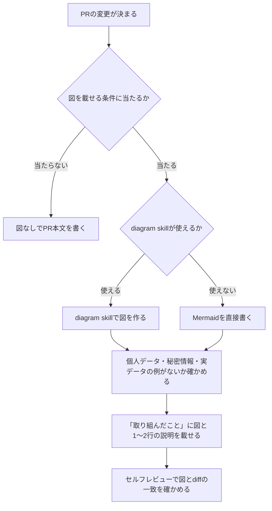

# TASK-022: 主要な図をPR本文に残す

## 1. Status

実施中（2026-10-08）。

## 2. Goal

データフロー・state・API・処理の順序が変わるPRで、主要な図をMermaidでPR本文の「取り組んだこと」に残す。
人間のレビュー用ガイド（Artifact）を開かなくても、PRの履歴から変更の形を辿れるようにする。

## 3. Background

- 人間のレビュー用ガイドはArtifactとして別に作っており、図と説明はPRの履歴に残らない。
- [TASK-022](../tasks/TASK-022-diagram-in-pr.md)で、図を載せる条件と手順を`pr-review-cycle`・`run-task`に入れることを決めている。
- `diagram` skillは個人の環境（`~/.claude/skills/diagram/`）にあり、リポジトリにはない。定期実行などで使えない環境がある。
- リポジトリは公開されており、PR本文も公開される。

## 4. Current State

- [pull-requests.md](../development/pull-requests.md)はPRの大きさ・分け方・人間のレビューの時機を定めるが、PR本文の図には触れていない。
- [AGENTS.md](../../AGENTS.md)の「Pull Requests」はPR本文の4節の構成を定める。
- [`pr-review-cycle`](../../.claude/skills/pr-review-cycle/SKILL.md)の1-7と[`run-task`](../../.claude/skills/run-task/SKILL.md)の手順7がPR本文を書くが、図の手順はない。
- 文書の中のMermaid図は、PR #69（`docs/privacy.md`・`docs/dot-history.md`）で既に使っている。そのレビューでは「図が正本より多く・少なく語る」指摘が多く、「図は要約であり、表・箇条を正とする」と添えて収めた。
- `diagram` skillは図の種類（シーケンス図・ER図・関係図・マインドマップ）の選び方と、図の下に1〜2行の説明を書く手順を持つ。

## 5. Scope and Non-goals

- 対象: 図を載せる条件・載せる節・書き方の規約（pull-requests.mdに正本を置く）、`pr-review-cycle`と`run-task`への手順の追加、AGENTS.mdからの参照。
- 対象外: PRテンプレート（`.github/pull_request_template.md`）の4節の構成は変えない。Artifactのガイドは置き換えない。
  `diagram` skillをリポジトリへ入れることはしない（個人の環境のファイルで、リポジトリの外のファイルはAIが変えない）。
- 決定（タスクに書かれたもの）: 載せる節は「取り組んだこと」。`diagram` skillがない環境ではMermaidを直接書く。図に個人データ・
  秘密情報・実データの例を載せない。
- このPlanで決める細部（タスクの範囲内の既定値として採る）:
  - 条件は「データフロー・state・API契約・データモデル・複数の主体にまたがる処理の順序が変わる」の5つにする。
    タスクの「データフロー・state・APIの変更など」を、PR #69で図にした種類（データの所在・画面の導線）と、
    `diagram` skillの図の選び方（ER図・シーケンス図）に合わせて具体化した。
  - 図は1つのPRで1〜2枚にする。主要な図だけを残すため。
  - PRを分けた場合は、図はその変更を含むサブのPRに載せる。人間がdiffと並べて読むのはサブのPRのため。
  - 修正前のsecurityの問題の経路を図にしない。TASK-021の「修正前のsecurityの指摘は具体的な場所と再現方法を記録に含めない」と揃える。
  - 図はPR本文の箇条書きの要約で、食い違えば箇条書きとコードを正とする。PR #69の指摘の型を繰り返さないため。

## 6. References and Documents to Update

- 参照: [TASK-022](../tasks/TASK-022-diagram-in-pr.md)、[TASK-021](../tasks/TASK-021-failure-classification.md)（検査・許可・reviewerの定義）、
  [pull-requests.md](../development/pull-requests.md)、[documentation.md](../code-review/documentation.md)、
  [AGENTS.md](../../AGENTS.md)の「Pull Requests」、`diagram` skill（個人の環境）、PR #69
- 更新: [pull-requests.md](../development/pull-requests.md)（正本）、[AGENTS.md](../../AGENTS.md)（参照の1行）、
  [`pr-review-cycle`](../../.claude/skills/pr-review-cycle/SKILL.md)、[`run-task`](../../.claude/skills/run-task/SKILL.md)、
  [TASK-022](../tasks/TASK-022-diagram-in-pr.md)

## 7. Proposed Approach

1. pull-requests.mdに「PR本文の図」の節を足し、条件・載せない例・載せる節・図の種類・書き方・載せてはいけないもの・
   `diagram` skillがない環境での代わりを書く（正本）。
2. AGENTS.mdの「Pull Requests」に、図はpull-requests.mdの「PR本文の図」に従うと1行足す。規則は複製しない。
3. `pr-review-cycle`の1-7（PR作成）に、条件に当たるか判定して図を載せる手順を足す。手順2（セルフレビュー）に図とdiffの
   一致・載せてはいけないものの確認を、手順6（修正）に図が変わったら本文を直すことを足す。
4. `run-task`の手順7（PR作成）に、同じ節に従って図を載せることを足す。
5. このPR自体が条件（複数の主体にまたがる処理の順序が変わる）に当たるため、PR本文に図を載せ、GitHubでの描画を確かめる。
   検査・許可・reviewerの定義（AIへの指示）を変えるため、変えたファイルと検査が緩んでいないことの確認を「確認すること」に挙げる。

## 8. Why This Approach

- 規則の正本をpull-requests.mdの1か所に置き、skillとAGENTS.mdは参照と手順だけにする（AGENTS.mdの二重化回避）。
- テンプレートの節を増やさず「取り組んだこと」の中に置くので、既存のPR本文の読み方が変わらない。
- `diagram` skillの有無で手順が分かれないよう、図の種類と書き方を正本に書いておき、skillはその補助として扱う。

## 9. Data Flow

アプリのデータフローの変更はない。PR作成の手順の流れは次のとおり（このPRの本文にも同じ図を載せる）。



## 10. Files to Change

1つのPR（レビュー対象6ファイル）。ブランチは`docs/task-022-diagram-in-pr`。

- 新規: このPlan
- 変更: `docs/development/pull-requests.md`（図の規約の正本）
- 変更: `AGENTS.md`（参照の1行）
- 変更: `.claude/skills/pr-review-cycle/SKILL.md`（PR作成・セルフレビュー・修正の手順）
- 変更: `.claude/skills/run-task/SKILL.md`（PR作成の手順）
- 変更: `docs/tasks/TASK-022-diagram-in-pr.md`（状態・Plan・完了条件）

## 11. Libraries / APIs

- Mermaid（GitHubがmarkdownの` ```mermaid `ブロックを描画する）。新しいdependencyは足さない。
- 構文の確認に、npxのキャッシュにある`@mermaid-js/mermaid-cli`を使う（リポジトリには入れない）。

## 12. Alternatives Considered

- テンプレートに「図」の節を足す案: タスクが4節の構成を変えないと決めているため採らない。
- 図をArtifactからPR本文へ移す案: タスクがArtifactを置き換えないと決めているため採らない。
- `diagram` skillをリポジトリへ入れる案: 個人の環境のファイルで、AIが変えない範囲のため採らない。図の種類の選び方だけ正本に書く。

## 13. Risks / Things to Watch

- `pr-review-cycle`の同じ節を、TASK-019〜TASK-021も変える予定がある（[タスクの運用ルール](../tasks/README.md#運用ルール)）。
  コンフリクトは人間が再開したセッションで解消する。
- skillの変更はworktreeの中ですぐ効き、このPRのその後のレビュー手順にも使われる。検査を緩める変更は含めない。
- 条件の判定はAIの判断に残る。機械的には強制しない（PR本文の検査は今はない）。

## 14. Verification

### Manual

- 条件に当たるPRと当たらないPRで図の有無が分かれることを、過去のPRに条件を当てはめて机上で確かめる。
- このPRの本文の図がGitHubで描画されることを確かめる（人間が画面で確認する）。

### Automated

- `pnpm lint:markdown`
- PR本文の図を`@mermaid-js/mermaid-cli`で描画できること。

## 15. Definition of Done

- TASK-022の完了条件を満たしている。
- markdownのlintが通る。
- 変更内容を人間が説明できる。

## 16. Completion Record

- 状態: 未記録。
